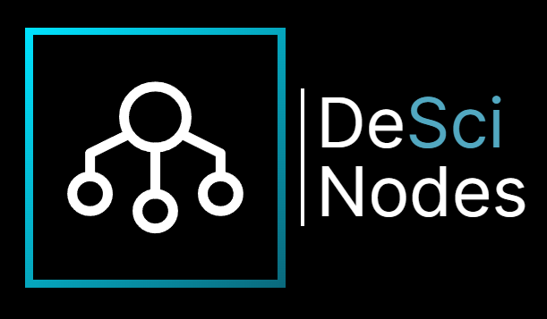

# DeSci Nodes

### A radically open architecture for verifiable research.

Brought to you by [DeSci Labs](https://desci.com) and the DeSci OSS community.

## What is DeSci Nodes?

Nodes is a tool for creating research objects - a type of verifiable scientific publication that combines manuscripts, code, data and more into a coherent unit of knowledge.

Nodes are published on a decentralized (“Open State”) repository that provides open content resolution, storage, provenance, data cataloguing, secure PIDs, and compute capabilities.

These resources will help you if you want to learn more (or join us on [Discord](https://discord.gg/A5P9fgB5Cf)):<br>
[Beta announcement post](https://descilabs.substack.com/p/574f74ae-7c4c-4016-9c50-20093d654698)<br>
[User documentation](https://docs.desci.com/using-nodes/getting-started)<br>
[Learning materials](https://docs.desci.com/learn/open-state-repository)

## Where to find the community

The best place to find the community is on the DeSci Labs Discord server. There you will find contributors working on various projects, the DeSci Labs team, scientists and researchers, Node Stewards, and other open-science enthusiasts. Come ask questions, test your ideas and projects, and get involved with the events we host every week!

[Discord](https://discord.gg/A5P9fgB5Cf)<br>
[Community Google Calendar](https://calendar.google.com/calendar/u/2?cid=Y181MWUxMDI2ZTA4Zjg4N2IzNDQ1ZDE0ODk2N2M4ZGE3NWY4OWM2ZmViYTNlZjAxZWZhZTZiZjRhOWEzMGE1MmJkQGdyb3VwLmNhbGVuZGFyLmdvb2dsZS5jb20)

## Contributing

New contributors are very welcome!

We are actively building out resources for open source contributors. Check back often to see what's new!

[Code of Conduct](https://github.com/desci-labs/nodes/blob/develop/CODE_OF_CONDUCT.md)

The simplest ways to get involved are to:

- Make a PR, issue, or hit us up on [Discord](https://discord.gg/A5P9fgB5Cf)
- Submit a bug as an issue
- Submit a feature request as an issue
- Write and polish documentation
- Translate

DeSci Nodes is developed, maintained, and supported by DeSci Labs. Contributions and PRs are reviewed and approved by the DeSci Labs team. We are actively looking for contributors and projects to support, so get involved!

We would like to open up our task management software, let us know if interested in early access.

---

# Modules

## **desci-contracts**

Houses all the tooling to build and deploy the ResearchObject contracts locally and for production. Includes a subgraph configuration for The Graph, which is run in a local Docker container and autodeploys your contract locally.
<br>

## **nodes-web-v2**

This is the React-based frontend for DeSci Nodes. It implements a Research Object viewer with support for editing and viewing IPLD-compliant JSON-LD self-describing linked data objects. It implements a frontend resolution of the [dPID](https://dpid.org) Resolution Scheme.

_Note:_ This repo lives separately at [https://github.com/desci-labs/nodes-web-v2](https://github.com/desci-labs/nodes-web-v2) because it has a different open source license.
<br>

## **nodes-media**

This is a NodeJS backend that helps Nodes with media transcoding videos to HLS using ffmpeg, and also helps run headless browser sessions to download PDFs and other free/fair-use media from the internet. It also implements an experimental LaTeX rendering service.
<br>

## **desci-models**

This is a Typescript types library that describes a spec for Research Objects. It has an internal representation used by `nodes-web-v2` and `desci-server` and can marshal/unmarshal to JSON-LD to be self-describing.
<br>

## **desci-server**

This is a NodeJS backend that manages draft Nodes. It maintains a user auth, verifies wallet credentials, offers 2FA to users, and is the main system that orchestrates between microservices. It maintains version history for each update to Nodes. It interfaces with a Graph index to implement the [DPID](https://dpid.org) Resolution Scheme.
<br>

## **nodes-lib**

A library for programmatically interacting with Nodes, basically allowing automation of actions possible in the webapp. See separate documentation in the [README](./nodes-lib/README.md).
<br>

## **reverse-proxy**

A tiny service for proxying route segments to given target URL's, allowing hiding many target destinations under aliases on one domain. See docs in [README](./reverse-proxy/README.md).
<br>

## **desci-art-viewer**

Nobody knows why this is still here, but it implements a React+Three.js 3d torus that plays [Conway's Game of Life](https://en.wikipedia.org/wiki/Conway%27s_Game_of_Life) on the surface of the torus. We were totally inspired by [this gif on Wikipedia](https://en.wikipedia.org/wiki/Conway%27s_Game_of_Life#/media/File:Trefoil_knot_conways_game_of_life.gif) and it only seems to work on Mac/Linux right now, YMMV.
<br>

There is more information on each module within each folder's individual README.md.
<br>

---

# Running Locally

The following guide is meant to get you running for full-stack dev on your local environment.

## 1) Run Backend + All Services

Make sure you have these packages installed on your system:

- Docker
- docker compose (comes with Docker Desktop, otherwise install the plugin package for your OS)
- lsof (may not be available by default depending on OS)

<br>

```bash
# Now run all services in Docker containers
./dockerDev.sh
```

This starts:

1. postgres (http://localhost:5433)
2. desci-server (http://localhost:5420)
3. ganache ledger (autodeploys ResearchObject + dPIDRegistry contract locally) (http://localhost:8545, metamask can connect to it locally)
4. expedition explorer for local dev (http://localhost:3001)
5. graph index pointing to latest deployed contract (http://localhost:8080)
6. Local IPFS node (private, swarm key enabled) (http://localhost:5001 or http://localhost:8089)
7. Local Ceramic node, run `bootstrapCeramic.sh` to initialize (http://localhost:7007)

**Note:** The Ceramic publish functionality needs to be activated by setting the corresponding environment variable, see `.env.example` for instructions.

**Note:** nodes-media (http://localhost:5454, responsible for DOI / PDF downloads, and for media transcoding) is disabled in the dev cluster by default, but can be uncommented in `docker-compose.dev.yml` for local development
<br>

_Optional:_ Edit the DB, open http://localhost:5555

1. Go to User table
2. Edit user to have your email (or use the default user, `noreply@desci.com`)

---

## 2) Run frontend

Follow the instructions in [`nodes-web-v2`](https://github.com/desci-labs/nodes-web-v2) and run the frontend.

Enjoy your local development setup of Nodes!

---

## _Optional_: Run VSCode Server locally

You may want to run VSCode server locally instead of using the default https://desci.dev to test VSCode extension development and other Nodes integrations with VSCode.

The recommended option is to use our [code-server configuration](https://github.com/desci-labs/code-server)

```
# in a separate dir
git clone https://github.com/desci-labs/code-server
# starts server on http://localhost:8085
./start.sh
# make sure you modify REACT_APP_CODE_SERVER in ../nodes-web-v2/.env
```

Another option is to run run openvscode-server:

```
docker run -it --init -p 8085:3000 -v "$(pwd):/home/workspace:cached" gitpod/openvscode-server
```

Note: Modify desci-dapp/.env `REACT_APP_VSCODE_DISABLE=1` to use old custom code viewer
<br>

---

# Troubleshooting

[Troubleshooting Page](https://github.com/desci-labs/nodes/wiki/Local-Environment-Troubleshooting)

---

# Deploying

Every Github push to develop will auto build + deploy to nodes-dev server cluster.

- nodes-web-v2 is deployed to both Amplify and Vercel, depending on the branch.
- desci-server is deployed to Kubernetes cluster via Github action.

---
